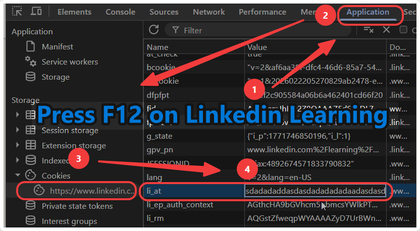

# LinkVault



LinkVault helps you save LinkedIn Learning courses you already have access to into a local folder, so your learning materials are easier to organize, revisit, and study offline.

## What You Can Do

- Download course videos into a folder you choose.
- Save subtitles, exercise files, quiz notes, and a readable `Study.md` guide when available.
- Queue multiple course links and track progress in one place.
- Retry failed downloads without rebuilding the whole list.
- Save your cookie once, then reuse it for future launches.
- Keep data local to your machine.

## How To Use

1. Install LinkVault with the Windows installer.
2. Open LinkVault.
3. Paste one or more LinkedIn Learning course URLs.
4. Choose the download folder and quality.
5. Paste your LinkedIn `li_at` cookie once, or use a supported browser session.
6. Click **Start Download**.

Your downloads are saved into the folder you picked. Your saved session is protected with Windows encryption and stored locally.

## Requirements

- Node.js with npm
- Rust toolchain
- Microsoft C++ Build Tools or Visual Studio Build Tools
- Microsoft WebView2 Runtime

## Run Locally

Use this when you want to work on the app from source.

```powershell
git clone https://github.com/Howard-Starfield/LinkVault-Linkedin-Learning-Courses-Downloader.git LinkVault
cd LinkVault
npm --prefix apps\desktop install
npm run dev
```

If PowerShell blocks `npm.ps1`, either run this once:

```powershell
Set-ExecutionPolicy -Scope CurrentUser RemoteSigned
```

or use the `.cmd` shim:

```powershell
npm.cmd run dev
```

The desktop app opens from Tauri. The Vite frontend runs at:

```text
http://127.0.0.1:1420
```

## Build The App

Use this when you want a production executable or Windows installer.

```powershell
npm run tauri -- build
```

Production outputs:

```text
apps\desktop\src-tauri\target\release\linkvault.exe
apps\desktop\src-tauri\target\release\bundle\nsis\LinkVault_0.1.3_x64-setup.exe
```

## Publish An Update

The release workflow runs when you push a version tag like `v0.1.4`. It builds the Windows installer, creates a GitHub release, and uploads `latest.json` for the in-app updater.

1. Bump the version in `apps/desktop/package.json`, `apps/desktop/src-tauri/Cargo.toml`, and `apps/desktop/src-tauri/tauri.conf.json`.
2. Run:

```powershell
npm run build
npm run cargo:test
```

3. Commit and push the version bump.
4. Create and push the tag:

```powershell
git tag v0.1.4
git push origin main
git push origin v0.1.4
```

Users on older signed builds can use the in-app update button after the GitHub release finishes.

## Frontend-Only Preview

This is useful for UI work, but desktop-only features need Tauri.

```powershell
npm run web:dev
# open:
http://127.0.0.1:1420
```

## Verify A Release

Useful checks before sharing a build:

```powershell
npm run cargo:test
npm run verify:visual
npm run verify:ui
npm run verify:release
npm run verify:installer
npm run verify:release-manifest
```

## Responsible Use / Ownership

Only download content you are allowed to access and archive. LinkVault does not bypass DRM, paid access controls, or site restrictions.
Copyright (c) 2026 Howard Deng. All rights reserved.
