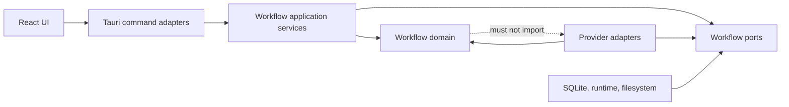

# ADR-001: Unified workflow modular monolith

**Status:** Accepted

**Date:** 2026-07-26

**Decision owners:** Howard Deng and LinkVault engineering

**Related plan:** [Unified workflow migration plan](unified-workflow-migration-plan.md)

## Context

LinkVault currently implements LinkedIn Learning, Coursera, and Newspaper as
three independent execution engines. Each owns some combination of job state,
events, scheduling, cancellation, retry, restart recovery, database access,
progress reporting, and frontend processing. The provider domains are
legitimately different, but these execution concerns are not.

The duplication makes responsiveness and correctness depend on which provider
is active. It also gives future features no stable template: copying an
existing provider would copy its scheduler and lifecycle defects as well as
its useful domain behavior.

The application is a local, single-user Tauri desktop product. It needs strong
offline behavior and simple installation more than independent deployment or
distributed scaling.

## Decision

LinkVault will remain one deployable modular monolith and introduce a shared,
durable workflow kernel using ports-and-adapters boundaries.

- Provider modules own validation, discovery, planning, provider clients,
  provider-specific data, and step executors.
- The workflow kernel owns durable runs and steps, transitions, leases,
  retries, cancellation, recovery, resource governance, progress revisions,
  schedules, and workflow audit events.
- Tauri commands are thin adapters into application services.
- React submits work and renders state; it does not schedule or process jobs.
- SQLite remains the local database. Application writes are serialized through
  a single writer boundary and reads use WAL-compatible read connections.
- State changes and audit events are committed atomically. This is a
  transactional audit/outbox design, not full event sourcing.
- Migration uses a strangler approach with temporary compatibility facades and
  provider-by-provider cutovers.

## Dependency direction

The final dotted edge is prohibited: workflow domain code must not know which
providers exist.

## Options considered

### Keep three engines and extract helpers

Rejected. Shared helper functions would reduce lines of code while preserving
three lifecycle owners, three recovery policies, and three sources of truth.

### Microservices or an external workflow server

Rejected. Independent deployment is not needed and the operational, network,
installation, and distributed-consistency costs conflict with an offline
desktop product.

### Full event sourcing

Rejected. LinkVault needs current state plus an ordered diagnostic history. It
does not need to rebuild every projection from an indefinite event stream.

### Big-bang rewrite

Rejected. Existing provider clients, download behavior, media serving, reading
state, and release evidence are valuable and must be migrated behind stable
adapters rather than rewritten together.

## Consequences

### Benefits

- One place to enforce valid transitions, retry policy and restart recovery.
- One resource governor for network, disk, CPU and external-process work.
- UI progress can become incremental instead of repeatedly loading full
  provider bootstrap objects.
- A future provider implements a planner and step executors instead of another
  queueing system.
- Existing provider behavior can migrate independently.

### Costs

- Temporary compatibility exports and legacy projections will exist during the
  migration.
- Workflow contracts and provider boundaries add explicit types and tests.
- Database migration and rollback evidence are required before each cutover.
- Existing cross-module imports must be retired deliberately instead of being
  hidden by permanent aliases.

## Guardrails

- No provider cutover without database backup and restoration proof.
- No dual writing to legacy and new workflow state.
- No destructive legacy-table removal during the first compatibility release.
- No credential material in generic workflow storage.
- No hard-coded concurrency limit without release-build measurement.
- No claim of responsiveness based only on unit tests or a web preview; native
  Windows profiling and installed-app UAT remain separate gates.

## External guidance used

- Tauri commands, state and channels:
  <https://v2.tauri.app/develop/calling-rust/>
- Tokio graceful shutdown:
  <https://tokio.rs/tokio/topics/shutdown>
- Tokio blocking work:
  <https://docs.rs/tokio/latest/tokio/task/fn.spawn_blocking.html>
- SQLite isolation and WAL:
  <https://www.sqlite.org/isolation.html>
- SQLite transactions:
  <https://www.sqlite.org/lang_transaction.html>
- Transactional outbox:
  <https://docs.aws.amazon.com/prescriptive-guidance/latest/cloud-design-patterns/transactional-outbox.html>
- Windows responsiveness measurement:
  <https://learn.microsoft.com/en-us/windows/apps/develop/performance/planning-measuring-performance>
