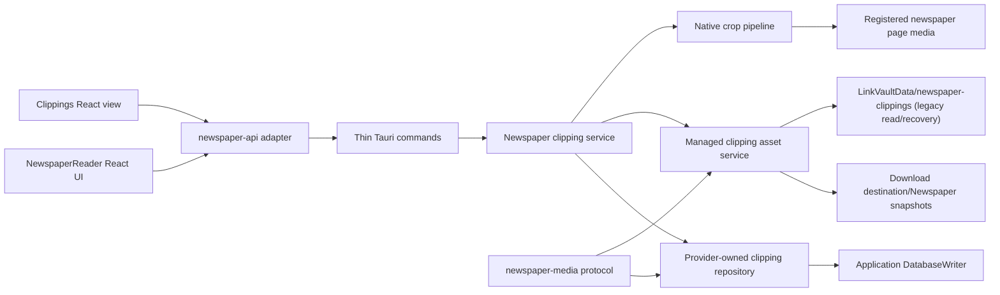

# ADR-002: Newspaper clippings as provider-owned managed assets

**Status:** Accepted

**Date:** 2026-08-07

**Storage amendments:** 2026-08-09 (D-032, D-033)

**Decision owners:** Howard Deng and LinkVault engineering

**Related architecture:** [ADR-001: Unified workflow modular monolith](adr-001-unified-workflow-modular-monolith.md)

**Related specification:** [Newspaper Clippings V1](../specs/newspaper-clippings-v1/README.md)

## Context

LinkVault can download, optimize, browse, and read World Journal newspaper
editions offline. A reader currently has no durable way to preserve a specific
article region together with personal notes. The requested workflow is:

1. Enter a clipping mode from the newspaper reader.
2. Drag over one region on one newspaper page.
3. Save that region at the best available source resolution.
4. Automatically create a note associated with the saved image.
5. Review and edit saved clippings in a dedicated World Journal view.
6. Preserve the clipping even if the downloaded edition is later removed.

The application is a local, single-user Tauri desktop product. Newspaper page
files may live in user-selected download folders, while the LinkVault database
and application-owned data live beneath the resolved `LinkVaultData` directory.
Downloaded editions are replaceable source material; a user-created clipping
and note are durable user data.

A rendered WebView screenshot would bind the saved result to reader zoom,
window size, display scale, CSS tone, and browser rasterization. It would also
lose source pixels when the reader displays a page below its native size. The
newspaper backend already tracks page identity, media version, pixel dimensions,
original and optimized paths, and a protected media protocol. The crop should
therefore be produced from registered source media rather than from the screen.

The application does not yet have a general cross-provider notes domain. Adding
one solely for Newspaper would enlarge the architecture before LinkedIn and
Coursera have corresponding requirements. The feature must remain compatible
with ADR-001: provider-specific domain data remains provider-owned, long-running
image work stays outside database transactions, and application writes use the
owned database boundary.

## Decision

LinkVault will implement Newspaper Clippings V1 as a provider-owned aggregate
beneath `providers/newspaper` with the following architecture.

### Canonical capture

- The frontend sends a page identifier, expected media version, and a normalized
  rectangle measured against the displayed page image.
- Rust resolves the registered page and crops the highest-quality available
  source: a valid retained original first, otherwise the current optimized
  image.
- The canonical clipping is encoded as lossless WebP without resizing.
- Reader zoom, browser device-pixel ratio, page tone, and display scaling do not
  affect the saved pixels.
- A WebView screenshot is not a canonical capture path in V1.

### Aggregate ownership

One clipping owns:

- Immutable source-provenance snapshots.
- Source-pixel crop coordinates.
- One application-managed image asset.
- One user-editable title.
- One Markdown note.
- One optimistic revision used to reject stale note updates.

V1 uses one clipping to one note. Multiple clipping attachments in one note are
deferred.

### Persistence

- SQLite is the source of truth for clipping metadata, title, and Markdown.
- The Newspaper provider owns the clipping table and repository.
- Source page and job foreign keys are nullable and use `ON DELETE SET NULL`.
- Edition, publication date, page number, source dimensions, and crop coordinates
  are also stored as denormalized snapshots so the clipping remains meaningful
  after its source edition is removed.
- Schema installation and migration remain owned by the application database
  lifecycle. Introducing the table requires a global schema-version increment,
  verified pre-migration backup, migration tests, and persistence-gate evidence.

### Asset storage

- New canonical clipping bytes live beneath the source batch's persisted
  download destination at `Newspaper snapshots/<edition>/<date>/<clipping-id>/`.
- SQLite stores a stable backend-owned root ID plus an application-controlled
  relative path, never an arbitrary frontend path.
- A marker in the root's reserved `.linkvault` subtree binds the registered
  root ID to that physical directory. Read/recovery paths never recreate a
  missing registered root.
- Existing schema-v3 assets remain under `LinkVaultData/newspaper-clippings`
  through a read-only `legacy_managed` root; they are not moved automatically.
- Settings exposes the registered snapshot roots created from download
  destinations; it does not provide an arbitrary global destination override.
- A user may recheck an unavailable root or reconnect a moved root only by
  selecting the existing marker-bound `Newspaper snapshots` directory. The
  backend verifies the marker before changing the stored locator and never
  scans, merges, moves, or creates snapshot content during reconnect.
- Asset writes use a staging file, validation, and atomic promotion.
- The clipping row is inserted only after the canonical asset has been promoted.
- If the database insert fails, the newly promoted asset is removed or moved to
  a recoverable cleanup area.
- Derived list thumbnails are cache data and may be regenerated; they are not
  the canonical clipping.

### Note presentation

- The clipping image is rendered as a fixed source card above the note editor.
- It is not inserted as an editable image node inside the Markdown document.
- The editor is a frontend adapter that emits plain Markdown.
- The Rust backend stores and validates Markdown but does not own WYSIWYG
  rendering behavior.
- Raw executable MDX, arbitrary scriptable HTML, and remote editor services are
  prohibited in V1.

### Media access

- React receives versioned `newspaper-media` URLs rather than filesystem paths.
- The existing media protocol is extended with clipping and clipping-thumbnail
  variants.
- Protocol resolution validates identifiers, versions, canonical containment,
  regular-file type, supported MIME type, and non-empty content.
- Error responses do not expose absolute paths.

### Lifecycle semantics

- Saving a clipping creates the managed image and database record as one
  recoverable operation.
- Deleting a downloaded edition does not delete its clippings.
- Resetting World Journal provider download data does not delete clippings or
  clipping notes.
- Deleting a clipping deletes its note and managed canonical asset after an
  explicit user action.
- A missing source edition disables `Open source` but does not make the clipping
  unreadable.
- A missing canonical asset is surfaced as a recoverable data-integrity state;
  the database record is not silently deleted.
- An offline or marker-mismatched snapshot root does not make SQLite titles or
  notes unavailable and does not change clipping asset state merely because a
  status probe failed.

### Concurrency and responsiveness

- Full-page decode, crop, checksum, and WebP encoding run outside database
  transactions and off the UI-sensitive execution path.
- V1 bounds concurrent full-image crop operations to avoid multiple large page
  decodes exhausting memory.
- Database mutations use the serialized application writer boundary.
- Note autosave uses optimistic revisions; a stale client receives a conflict
  instead of overwriting newer content.

## Dependency direction

The clipping service may depend on shared application database and storage
services. It must not create another scheduler, generic workflow engine, or
cross-provider notes system.

## Options considered

### Save a screenshot of the reader

Rejected as the canonical path. A screenshot captures rendered pixels after
reader zoom, device scaling, CSS tone, and clipping by the window. It can be a
future export option for preserving visual appearance, but it is not suitable
for durable high-resolution source capture.

### Store clipping files inside the downloaded edition directory

Rejected. Source-edition deletion must not own clipping deletion. The approved
snapshot root is a protected sibling under the persisted download destination,
not a child of an individual downloaded edition. Archive scans and source reset
explicitly exclude `Newspaper snapshots`.

### Embed the image as the first node in a rich-text document

Rejected. The user could accidentally remove or reorder the source evidence,
provenance would become editor-specific, and future editor replacement would
be coupled to attachment ownership. A fixed source card and separate Markdown
body preserve both provenance and editor portability.

### Introduce a general notes platform now

Rejected for V1. Newspaper has a clear provider-owned aggregate, while other
providers do not yet have approved shared-note requirements. A cross-provider
notes domain may be introduced later through a separate ADR and migration plan.

### Store editor-specific JSON as the source of truth

Rejected. It would bind durable user content to a particular frontend package.
Plain Markdown provides a stable local representation and future export path.

### Store only normalized coordinates

Rejected. Normalized coordinates are appropriate for the frontend request, but
persisted source-pixel coordinates are deterministic, inspectable, and remain
valid without reproducing browser layout calculations.

## Consequences

### Benefits

- Saved text retains the maximum pixels available from registered source media.
- Clippings remain useful after source edition deletion or reset.
- Notes remain portable and editor-independent.
- Provider ownership stays consistent with ADR-001.
- Filesystem paths remain hidden from the frontend.
- Crop correctness can be tested deterministically at source-pixel boundaries.
- Future OCR, semantic indexing, export, and annotation features can build on a
  stable clipping aggregate without changing the V1 source of truth.

### Costs

- The feature requires coordinated database and managed-file recovery logic.
- Source deletion semantics must be tested across two nullable foreign keys.
- The reader needs an explicit gesture state machine because it already owns
  click-to-zoom and drag-to-pan interactions.
- A WYSIWYG editor integration still requires an isolated compatibility spike.
- Derived thumbnails add a cache lifecycle separate from canonical assets.
- Native Windows DPI and pointer behavior require manual installed-app UAT in
  addition to browser automation.

## Guardrails

- No implementation may begin until the specification PR is approved and
  merged.
- No crop operation may hold a database transaction during decode or encode.
- No frontend command may supply a destination filesystem path.
- No reconnect flow may create or rewrite a root marker, search arbitrary
  folders, or accept an unverified directory as an existing snapshot root.
- No protocol response may disclose an absolute path.
- No reset or source-edition deletion may cascade into clipping deletion.
- No editor package may become the persistent document format.
- No later-phase UI work may be folded into an earlier persistence or crop PR.
- No existing architecture, persistence, reader-performance, visual, or release
  gate may be weakened to make the feature pass.
- OCR, AI summaries, drawing annotations, multiple attachments per note, cloud
  synchronization, and a general notes workspace remain outside V1 unless this
  ADR is superseded.
