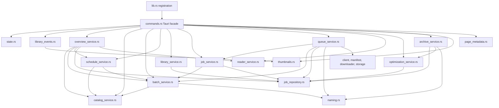

# Newspaper command target wiring and extraction plan

## Decision

`commands.rs` should become a thin, stable Tauri facade of roughly **300-450
lines**, not an artificially tiny file.

That budget is enough for:

- the 24 registered `#[tauri::command]` adapters;
- `State` extraction and lock acquisition;
- async and error-boundary translation;
- post-success invalidation or follow-up scheduling; and
- the app-setup adapter that starts page-dimension backfill.

The file should not own domain SQL, SQLite row mapping, validation policy,
download orchestration, scheduling algorithms, archive processing, image
metadata parsing, or terminal-state calculation. Line count is a guardrail, not
the reason for extraction: ownership and dependency direction decide where code
belongs.

## Completion status

The extraction completed on 2026-07-26. `commands.rs` is now 303 lines, all 24
registered command paths are unchanged, and the facade contains no newspaper
table SQL or row mapping. Domain behavior lives in the owners documented below,
and the characterization tests moved to `tests.rs`.

## Pre-extraction inventory

Before the final state/events, catalog/batch/schedule, overview/Library,
job-lifecycle, and queue slices, `commands.rs` was 2,579 lines. Approximately
1,888 lines were production code and 691 lines were in its mixed test module.

| Remaining responsibility | Current shape | Target owner |
| --- | --- | --- |
| Shared database path, cancellation, queue lock, revision, and backfill lock | `NewspaperState` in the facade | `state.rs` |
| Library invalidation and thumbnail prewarming | Tauri event and follow-up helpers in the facade | `library_events.rs` |
| Catalog reads and refresh | Commands, HTTP, parsing, persistence, and row mapping | `catalog_service.rs` |
| Batch creation and batch controls | Validation, catalog lookup, inserts, pause/cancel, and batch completion | `batch_service.rs` |
| Schedule creation/toggle/delete and due materialization | Validation, parsing, recurrence decisions, and SQL | `schedule_service.rs` |
| Bootstrap and activity read models | Cross-domain list composition and settings read | `overview_service.rs` |
| Library legacy list and paged query | Validation, SQL, row mapping, cache checks, and pagination | `library_service.rs` |
| Job retry/pause/reorder/dismiss and lifecycle helpers | Status policy, mutation SQL, retry calculation, and progress reconciliation | `job_service.rs` |
| Download queue | Queue selection, manifest/download/storage orchestration, and lifecycle transitions | `queue_service.rs` |
| Mixed command tests | Domain tests embedded below the facade | Tests beside each owning service plus a small facade contract test |

The remaining production code directly accesses editions, batches, jobs, pages,
schedules, progress, events, and settings tables. Those references should move
behind their owners; `commands.rs` should contain no table SQL or database row
mapping.

## Target module wiring

### Dependency rules

1. `lib.rs` keeps registering commands through `newspaper::commands::*`.
2. `commands.rs` may depend on state, Tauri event coordination, services,
   thumbnails, page metadata, and shared models.
3. Services must never depend on `commands.rs`.
4. Tauri-specific types belong only in the facade, `state.rs`,
   `library_events.rs`, or existing Tauri protocol adapters.
5. Repositories own SQL row mapping. Pure helpers such as naming and page
   metadata do not depend on services.
6. Cross-service dependencies follow the arrows above. A proposed reverse edge
   is a signal to stop and reconsider ownership.
7. Queue execution remains the outer orchestrator. Lower-level services must
   not start or recursively invoke the queue.

## Live public wiring

The table below is derived from the current `generate_handler!` registration in
`apps/desktop/src-tauri/src/lib.rs`. All 24 registered commands retain their
exact names, parameters, result types, serialized payloads, and facade paths.

| Registered command | What remains in `commands.rs` | Target owner called by the facade |
| --- | --- | --- |
| `bootstrap_newspaper_state` | Extract state and translate the result | `overview_service` |
| `list_newspaper_catalog` | Extract state and translate the result | `catalog_service` |
| `refresh_newspaper_catalog` | Extract state and preserve current error behavior | `catalog_service` |
| `create_newspaper_batch` | Extract state and translate the result | `batch_service` |
| `create_newspaper_schedule` | Extract state and translate the result | `schedule_service` |
| `toggle_newspaper_schedule` | Extract state and translate the result | `schedule_service` |
| `delete_newspaper_schedule` | Extract state and translate the result | `schedule_service` |
| `process_newspaper_queue` | Acquire/release the queue lock, reset cancellation, call due-schedule materialization, then invalidate on the same success condition | `schedule_service`, `queue_service`, and `library_events` |
| `process_newspaper_optimization_queue` | Acquire/release the existing shared lock and invalidate on the same success condition | `optimization_service` and `library_events` |
| `pause_newspaper_batch` | Extract state and set cancellation when the current behavior requires it | `batch_service` |
| `cancel_newspaper_batch` | Extract state and set cancellation when the current behavior requires it | `batch_service` |
| `retry_newspaper_job` | Extract state and translate the result | `job_service` |
| `set_newspaper_job_pause` | Extract state and set cancellation when pausing an active job | `job_service` |
| `reorder_newspaper_jobs` | Extract state and translate the result | `job_service` |
| `remove_newspaper_job` | Extract state and set cancellation for active work | `job_service` |
| `list_newspaper_library` | Extract state and translate the legacy query | `library_service` |
| `get_newspaper_library_page` | Validate/translate the async boundary only | `library_service` |
| `get_newspaper_activity_snapshot` | Capture the revision and translate the async boundary | `overview_service` |
| `get_newspaper_reader_manifest` | Translate the blocking-task boundary | `reader_service` |
| `save_newspaper_reading_progress` | Extract state and provide the timestamp | `reader_service` |
| `ensure_newspaper_thumbnail` | Extract thumbnail state and await deduplicated work | `thumbnails` |
| `open_newspaper_download_folder` | Keep the small platform-shell adapter in place | No new service unless another caller needs the same behavior |
| `import_existing_newspaper_archive` | Translate the blocking-task boundary and preserve successful follow-up timing | `archive_service`, `library_events`, and `page_metadata` |
| `repair_newspaper_library` | Translate the blocking-task boundary and preserve successful follow-up timing | `archive_service`, `library_events`, and `page_metadata` |

Two non-command public seams also remain stable:

- `NewspaperState` moves to `state.rs` and is re-exported through
  `commands.rs` until `lib.rs` can use `newspaper::state::NewspaperState`
  without changing application behavior.
- `schedule_page_dimension_backfill` remains a tiny app-setup adapter in the
  facade, delegating actual work to `page_metadata`.

`list_newspaper_library` is registered but currently has no frontend caller.
It remains intact during this refactor. Removal is a separate compatibility
decision with its own consumer search and migration.

## Extraction phases

### Phase 0 - Characterize the facade contract

- Freeze the 24 command names, parameter/result types, serialized shapes, and
  `lib.rs` registrations.
- Record current event names and timing, lock behavior, cancellation behavior,
  retry timing, filesystem cleanup order, and page-dimension follow-ups.
- Add or retain focused tests for lifecycle and scheduling edge cases before
  moving their implementations.

Exit gate: the inventory matches registration and frontend invocation strings.

### Phase 1 - Extract state and library event coordination

- Move `NewspaperState` and its accessors to `state.rs`.
- Move invalidation emission, thumbnail candidate lookup, and thumbnail
  prewarming to `library_events.rs`.
- Re-export state temporarily through the facade so registration can be changed
  independently.

Exit gate: all commands use the same state instances, locks, revision counter,
event name, event payload, and follow-up timing.

### Phase 2 - Extract catalog, batch creation, and batch controls

- Move catalog list/refresh, discovery persistence, and row mapping to
  `catalog_service.rs`.
- Move batch validation, edition selection, creation, list query, pause,
  cancel, and terminal completion to `batch_service.rs`.
- Preserve IDs, edition keys, default settings, conflict handling, requeue
  behavior, and cancellation signals.

Exit gate: catalog/batch tests pass and their SQL is absent from the facade.

### Phase 3 - Extract scheduling

- Move schedule list/create/toggle/delete, request validation, date parsing,
  due-date decisions, and due-schedule materialization to
  `schedule_service.rs`.
- Reuse catalog and batch services instead of copying selection or creation
  logic.
- Preserve enabled/disabled, daily trigger, last-run, error, and
  duplicate-materialization behavior.

Exit gate: clock-boundary and recurrence tests pass and schedule SQL is absent
from the facade.

### Phase 4 - Extract overview and Library reads

- Move bootstrap and activity-snapshot composition, including settings reads,
  to `overview_service.rs`.
- Move legacy Library listing and paged Library validation/query/mapping to
  `library_service.rs`.
- Reuse `job_repository.rs` rather than creating another general job mapper.
- Keep thumbnail prewarming as post-read/event coordination, not query logic.

Exit gate: bootstrap, activity, pagination, filter, cache-validity, empty-state,
and legacy Library contracts pass.

### Phase 5 - Extract job controls and lifecycle

- Move retry, pause, reorder, dismiss, interrupted-state, release retry,
  cross-date first-page detection, progress refresh, and batch reconciliation
  to `job_service.rs` or its lower repository helpers.
- Depend one way on `batch_service` for terminal batch reconciliation.
- Preserve every allowed/rejected transition and filesystem cleanup order.
- Return explicit effects when the facade must signal cancellation.

Exit gate: a transition matrix covers all status changes and job-control SQL is
absent from the facade.

### Phase 6 - Extract the download queue last

- Move due-job selection, `process_queue`, `process_job`, manifest/download/
  storage orchestration, page persistence, retry calls, and terminal
  transitions to `queue_service.rs`.
- Depend on stable batch/job services, the job repository, naming, and existing
  client/manifest/downloader/storage boundaries.
- Keep only lock/cancellation setup, schedule materialization call, error
  translation, and successful invalidation in the public adapter.

Why last: this code touches the broadest set of lifecycle and external
boundaries. The earlier phases give it stable dependencies.

Exit gate: success, partial failure, retry, pause, cancel, restart recovery, and
batch-completion tests pass.

### Phase 7 - Move tests and enforce the facade boundary

- Move domain tests beside their owning services.
- Keep a small facade contract test for registration-facing routing and error
  translation.
- Add a lightweight check or review rule preventing SQL and row mapping from
  returning to `commands.rs`.
- Recount only after ownership, wiring, and tests are correct.

Exit gate: `commands.rs` is approximately 300-450 lines and contains no domain
SQL, row mapping, schedule policy, downloader implementation, or terminal-state
algorithm.

## Behavior invariants

Every phase preserves:

- all 24 registered names, signatures, facade paths, and serialized shapes;
- database schema, migrations, IDs, edition keys, and path naming;
- the `newspaper://library-invalidated` event name, payload, and success timing;
- the current shared queue/optimization exclusion behavior;
- cancellation flags, retry delays, attempt counts, and restart recovery;
- download, import, repair, optimization, thumbnail, dimension-backfill, and
  cleanup ordering;
- bootstrap/activity/Library pagination and reader contracts; and
- current frontend invocation strings.

## Stop conditions

Stop a phase and repair its boundary if:

- a service must import `commands.rs`;
- a SQL row mapper or lifecycle algorithm would be duplicated;
- a move changes a public payload or database representation for convenience;
- domain tests require Tauri runtime setup;
- queue or schedule behavior cannot be characterized before movement;
- a reverse dependency or service cycle appears; or
- unrelated dirty-work changes would have to be overwritten.

## Definition of done

- `commands.rs` is a readable 300-450-line facade, not a general-purpose
  application module.
- All 24 commands remain registered through the same facade paths.
- The two non-command public seams remain available through their documented
  transition.
- Each domain has one owner and dependencies follow the target wiring.
- No table SQL or row mapping remains in `commands.rs`.
- Every extracted module has a responsibility comment and focused tests.
- Newspaper Rust tests, `cargo check`, `cargo fmt -- --check`, the frontend
  production build, and the established 8/50/500 performance contracts pass.
- Native/manual UAT is reported separately from automated proof.
