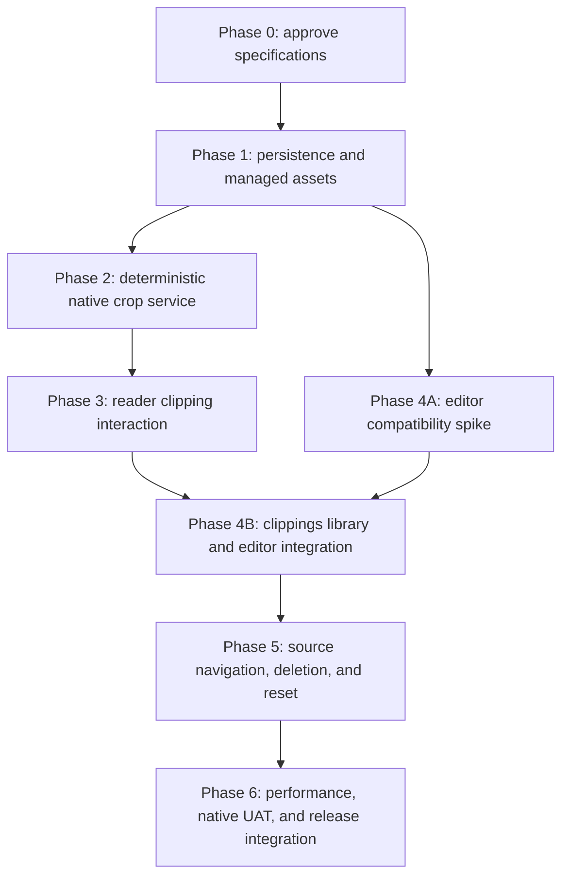

# Newspaper Clippings V1

**Document role:** Master product and implementation control document

**Status:** Approved

**Date:** 2026-08-07

**Product owner:** Howard Deng

**Architecture owner:** LinkVault engineering

**Implementation authorized:** Yes. Approved by Howard Deng on 2026-08-08 after
specification review. ADR-002 is Accepted and this specification set is
approved and merged to the default branch.

**Related architecture:**

- [ADR-001: Unified workflow modular monolith](../../architecture/adr-001-unified-workflow-modular-monolith.md)
- [ADR-002: Newspaper clippings as provider-owned managed assets](../../architecture/adr-002-newspaper-clippings-managed-assets.md)

## Product statement

Newspaper Clippings lets a reader preserve a meaningful region of a downloaded
World Journal page at source resolution and immediately attach personal notes
to it. The clipping remains available in a dedicated World Journal view even
when the source edition is later removed from the local newspaper library.

The feature is intentionally narrower than a general knowledge-management
system. V1 solves one complete local workflow:

```text
Read a downloaded newspaper
→ enter Clip mode
→ drag over one region on one page
→ save a source-resolution managed image
→ automatically create one Markdown note
→ continue reading or open the new note
→ later search, review, edit, reopen the source, or delete the clipping
```

## Approved V1 product contract

The following decisions were approved in product discussion on 2026-08-07 and
are treated as requirements unless superseded in the decision register.

1. The World Journal sidebar adds a third child named **Clippings**.
2. The reader toolbar adds a **Clip** action with a scissors icon.
3. Pressing `C` while the reader canvas owns focus enters clipping mode.
4. A clipping contains one rectangular region from one newspaper page.
5. The canonical saved image is cropped from registered source media, not from
   a WebView screenshot.
6. The backend prefers a valid retained original page image and otherwise uses
   the current optimized page image.
7. The crop is saved as lossless WebP without resizing.
8. Saving automatically creates one clipping record and one empty Markdown
   note.
9. The source image is a fixed attachment card above the note editor; it is not
   an editable image node inside the note body.
10. SQLite stores the title and Markdown source of truth.
11. Canonical clipping images live in an application-managed clipping root
    beneath `LinkVaultData`, not beside downloaded editions.
12. Saving returns the user to reader browse mode and offers an **Open note**
    action rather than forcing navigation away from the newspaper.
13. Deleting or resetting downloaded newspaper data preserves clipping images
    and notes.
14. When the original edition still exists, a clipping can open the exact page
    and briefly highlight its saved region.
15. OCR, AI summaries, drawing annotations, multiple clipping attachments in a
    note, tags, cloud synchronization, and a general cross-provider notes
    workspace are outside V1.

The complete decision history is in [00-decision-register.md](00-decision-register.md).

## Definitions

| Term | Definition |
|---|---|
| **Source page** | A completed row in `newspaper_pages` and the registered local image it resolves to. |
| **Normalized rectangle** | Frontend crop coordinates expressed as finite fractions relative to the displayed page image, independent of zoom and device scale. |
| **Source-pixel rectangle** | The deterministic integer crop rectangle persisted after backend conversion against decoded source dimensions. |
| **Canonical clipping asset** | The lossless WebP file owned by the clipping aggregate. It is durable user data. |
| **Derived thumbnail** | A regenerable, lower-resolution cache used only for list rendering. It is not durable user data. |
| **Clipping note** | The title and plain Markdown body owned by one clipping record. |
| **Source card** | The non-editable image and provenance block displayed above the editor. |
| **Source available** | Both source foreign keys still resolve to a completed page that can be opened in the reader. |
| **Asset ready** | The canonical clipping asset has been validated, promoted to its managed path, and marked ready in SQLite. |
| **Phase gate** | A mandatory entry or exit condition. A coding agent must stop when a phase exit gate is reached. |

## User value and success outcomes

V1 is successful when a user can:

- Save a legible article region without losing resolution because the reader was
  zoomed out.
- Continue reading immediately after saving.
- Find the clipping later from a dedicated local library.
- Type and autosave notes beneath the source image.
- Reopen the exact source page when it remains available.
- Keep the clipping and note after deleting or resetting downloaded editions.
- Recover clearly from missing source media, stale page media, save failures,
  note conflicts, and missing managed assets.

V1 is not successful merely because a crop button exists. The persisted asset,
note lifecycle, reset behavior, recovery paths, list performance, and native
Windows interaction gates are part of the same product.

## Global invariants

Every implementation phase must preserve these invariants.

### Product invariants

- One V1 clipping owns exactly one canonical image and one Markdown note.
- Saving a clipping never silently navigates away from the current newspaper.
- Reader tone and zoom never alter canonical saved pixels.
- An unavailable source does not make an existing clipping unavailable.
- The source card cannot be deleted through ordinary note editing.

### Architecture invariants

- Newspaper clipping behavior remains beneath `providers/newspaper`.
- Tauri commands remain thin adapters into provider application services.
- React does not receive or submit raw filesystem paths.
- No new scheduler, workflow engine, or cross-provider notes domain is created.
- Full-page image work remains outside database transactions.
- New clipping writes use the application-owned serialized writer boundary.

### Persistence invariants

- Any schema change increments the supported application schema version and
  participates in verified pre-migration backup.
- Source foreign keys use `ON DELETE SET NULL`, never `CASCADE`.
- Reset logic excludes clipping rows and managed clipping assets.
- Note updates use optimistic revision checks and never silently overwrite a
  newer revision.
- A database/file mismatch becomes a typed recoverable state rather than silent
  data deletion.

### Security invariants

- Media requests use validated identifiers and asset versions.
- Managed paths are derived by the backend and remain inside the clipping root.
- Symlinks, directories, empty files, unsupported media, and path escapes are
  rejected.
- Error messages returned to React do not reveal absolute paths.
- Plain Markdown is data; executable MDX and arbitrary scriptable HTML are not
  permitted.

### Performance invariants

- The reader retains its existing bounded page-image virtualization contract.
- The clipping list is paged and virtualized.
- Only visible list thumbnails are requested.
- At most one full canonical clipping image is intentionally mounted in the
  detail pane.
- Crop decode and encoding run off the UI-sensitive thread and are concurrency
  bounded.

## Specification map

| Document | Authority |
|---|---|
| [00-decision-register.md](00-decision-register.md) | Approved, rejected, deferred, and unresolved product or technical decisions. |
| [01-product-and-interaction-contract.md](01-product-and-interaction-contract.md) | User journeys, exact UI behavior, copy, accessibility, and final product acceptance. |
| [02-domain-persistence-and-assets.md](02-domain-persistence-and-assets.md) | Aggregate model, schema, repository contracts, managed-file lifecycle, recovery, and data limits. |
| [03-native-crop-pipeline.md](03-native-crop-pipeline.md) | Coordinate conversion, source resolution, crop encoding, validation, concurrency, and error contracts. |
| [04-reader-selection-interface.md](04-reader-selection-interface.md) | Reader gesture state machine, selection overlay, keyboard behavior, and reader-specific regression gates. |
| [05-clippings-library-and-note-editor.md](05-clippings-library-and-note-editor.md) | Clippings list/detail UI, editor adapter, Markdown subset, autosave, search, and editor selection gate. |
| [06-navigation-deletion-and-reset.md](06-navigation-deletion-and-reset.md) | Sidebar routing, source return navigation, deletion semantics, reset preservation, and unavailable states. |
| [07-verification-performance-and-release.md](07-verification-performance-and-release.md) | Test matrix, automated commands, evidence, performance measurement, accessibility, native UAT, and release gate. |
| [08-coding-agent-execution-contract.md](08-coding-agent-execution-contract.md) | Mandatory rules and PR evidence contract for an implementation agent. |

If documents conflict, authority is resolved in this order:

1. An approved superseding ADR.
2. The decision register entry with the latest approved date.
3. This master PRD.
4. The relevant detailed specification.
5. Existing implementation behavior.

An implementation agent must stop and request a specification change when a
conflict cannot be resolved by that order.

## Dependency graph



The graph means that Phase 4A may be evaluated after persistence contracts are
stable, but full library/editor integration may not begin before both the
reader save path and the editor decision gate are complete.

## Phase control table

| Phase | Scope | Entry gate | Exit gate | Status |
|---|---|---|---|---|
| 0 | Review ADR-002 and all V1 specifications. Resolve blocking decisions. | Documentation branch exists. | ADR-002 and all documents approved and merged. | Complete |
| 1 | Schema, repository, managed roots, asset state machine, protocol route, recovery foundations. No crop UI. | Phase 0 complete. | Migration, reset-preservation, repository, protocol, lifecycle, and persistence gates pass. | Complete |
| 2 | Native source resolver, normalized-to-pixel conversion, crop encoder, checksum, bounded blocking execution, create command. No reader selection UI. | Phase 1 complete. | Deterministic crop and failure-path tests pass; measured crop baseline recorded. | Ready |
| 3 | Reader Clip action, pointer/keyboard state machine, selection overlay, save confirmation, non-disruptive success flow. | Phase 2 complete. | Browser interaction matrix and native DPI smoke pass without reader virtualization regression. | Blocked |
| 4A | Compare approved editor candidates behind an isolated adapter. No production note UI. | Phase 1 complete and editor criteria approved. | One candidate is recorded as Approved in the decision register with evidence. | Ready |
| 4B | Sidebar Clippings view, paged/virtualized list, detail source card, selected editor, autosave, optimistic conflict handling, search/sort. | Phases 3 and 4A complete. | List, editor, IME, autosave, search, and conflict tests pass. | Blocked |
| 5 | Open-source navigation, return targets, transient highlight, clipping deletion, missing-source/missing-asset states, reset integration. | Phase 4B complete. | Lifecycle, recovery, navigation, delete, and reset tests pass. | Blocked |
| 6 | Final performance budgets, accessibility audit, native installed-app UAT, visual evidence, release verification. | Phase 5 complete. | All automated and manual release gates pass and evidence is committed. | Blocked |

## Required implementation PR sequence

Implementation must use reviewable PRs. A reviewer may split a phase further,
but a coding agent may not combine phases without an approved specification
change.

```text
PR 1  feat(newspaper): add clipping persistence and managed asset lifecycle
PR 2  feat(newspaper): add deterministic native clipping crop service
PR 3  feat(newspaper): add reader clipping selection workflow
PR 4A test(editor): evaluate clipping note editor candidates
PR 4B feat(newspaper): add clippings library and Markdown note editor
PR 5  feat(newspaper): add clipping source navigation and lifecycle controls
PR 6  perf(newspaper): certify clippings release and native UAT
```

Each implementation PR must:

- Name exactly one phase.
- Link the detailed specification.
- Map every changed behavior to requirement and acceptance-criterion IDs.
- Add tests in the same PR.
- Run the phase exit gate.
- Record failures as well as successful evidence.
- Include rollback instructions.
- Confirm that later phases were not implemented.
- Stop for reviewer approval after the exit gate.

## Global out of scope

The following are deliberately excluded from V1 and must not be added as
“helpful extras” by an implementation agent:

- OCR, text extraction, translation, or article reconstruction.
- AI title generation, summarization, embeddings, semantic search, or chat.
- Drawing, highlighting, arrows, handwritten annotations, or redaction.
- Multiple clipping images in one note.
- Attaching arbitrary local files to clipping notes.
- Tags, folders, collections, favorites, reminders, or spaced repetition.
- Sharing, export bundles, PDF generation, printing, or cloud synchronization.
- Mobile or web-only support.
- A cross-provider notes platform.
- Screenshot-based canonical capture.
- Cropping across two pages or selecting non-rectangular regions.
- Background bulk clipping or automatic article detection.

An excluded feature requires a separate decision and specification; it is not a
reason to weaken the V1 data model or test gates.

## Open decisions and blockers

The core product contract is approved. The following implementation choice is
intentionally deferred and blocks Phase 4B only:

- **OD-001: WYSIWYG package selection.** The persistent format and adapter are
  fixed, but the package must pass the Phase 4A React 19, Chinese IME, Markdown
  round-trip, Strict Mode, offline, accessibility, and bundle-impact spike.

No other open decision may be invented by an implementation agent. New
ambiguities must be added to the decision register and reviewed.

## Final completion definition

Newspaper Clippings V1 is complete only when all of the following are true:

- ADR-002 and this specification set are Approved.
- Every implementation phase is merged independently with its exit evidence.
- Existing architecture, persistence, UI, visual, Newspaper performance,
  browser performance, Rust, and release gates remain green.
- New clipping-specific automated gates are green at 8, 50, and 500 clipping
  fixture sizes.
- Installed Windows UAT passes at 100%, 125%, 150%, and 200% display scaling.
- Reset and source-deletion tests prove clippings and notes are preserved.
- Crop tests prove saved dimensions and pixels derive from source media rather
  than reader rendering.
- Chinese IME and autosave recovery tests pass in the selected editor.
- Release evidence and known limitations are committed.
- No V1 out-of-scope feature was introduced without a superseding decision.
